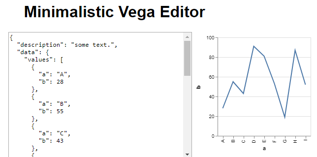

# App
This is a simple Vega editor, with some usefull functionalities, such as load data from csv files, upload your visualization to de db, see the most recent uploaded visualizations, and add a rating to each visualization uploaded. 

It is made with React for the frontend and Express.js with MongoDB for the backend. The React project is located in the `./frontend` folder. The final app has been deployed to heroku: https://web-dev-exam-1.herokuapp.com/ for public usage.

## How to run it
To run this project, you need to have npm or yarn installed.  

 - Clone the project from the github repository and go to de root directory of the project:  
 `git clone https://github.com/SeCardenas/web-dev-exam1.git`  
 `cd web-dev-exam1`  
 
 - Install backend project dependencies:  
 `npm install`  
 
 - Edit index.js file: edit the port variable to run mongoDB locally in the port you want and change the port in which express will connect to Another option is to add a .env file, with the variables MONGODB_PORT and PORT. Then, edit line 34, replace the variable `uri` with `url`, this is to connect to the local db instead of the remote one.
 
 - Then, run the index.js file:
 `node index.js`  
 
 - Go to the frontend directory, edit the package.json file and edit the field "proxy"; change the port to match the port in which express is running.
 
 - Install frontend project dependencies and run:  
 `cd ./frontend`  
 `npm install`
 `npm start`  
 
 - You can also use yarn (recommended):
 `yarn`
 `yarn start`

Afterwards, both projects will be running. Backend API calls are binded to `localhost:8080` and frontend development server is binded to `localhost:3000`. Requesting `localhost:3000` through browser will run the app as it is on heroku (It proxies it's requests to `localhost:8080`).

## Additional details
As you can see, this is a forked repository; that is because I forked the repository of my second project of the Web Development subject. It is clear that all the functionality of this application was made only by me. If you have any doubt, you can see the commit history.

## Authors
[Sergio Cárdenas](https://github.com/SeCardenas)

## License
[MIT License](https://github.com/SeCardenas/web-dev-exam1/blob/master/LICENSE)

## Preview

