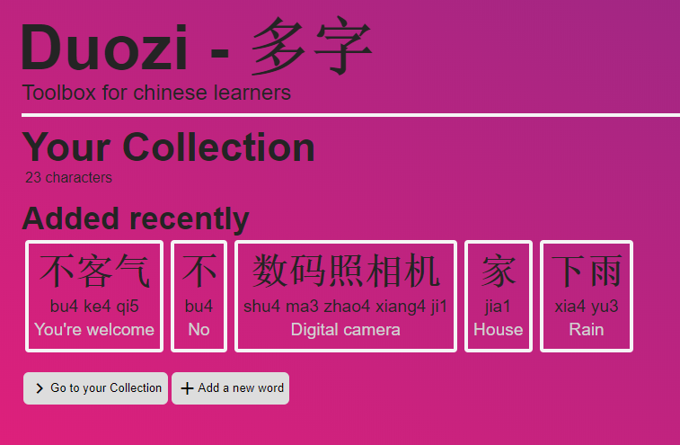

# App
Web application description. 

It is made with React for the frontend and Express.js with MongoDB for the backend. The React project is located in the `./frontend` folder. The final app has been deployed to heroku: https://web-dev-exam-1.herokuapp.com/ for public usage.

## How to run it
To run this project, you need to have npm or yarn installed. In this case, we will detail instructions for npm:  

 - Clone the project from the github repository and go to de root directory of the project:  
 `git clone https://github.com/SeCardenas/web-dev-exam1.git`  
 `cd duozi-web`  
 
 - Install backend project dependencies:  
 `npm install`  
 
 - Edit index.js file: edit the port variable to run mongoDB locally in the port you want and change the port in which express will connect to Another option is to add a .env file, with the variables MONGODB_PORT and PORT.
 
 - Then, run the index.js file:
 `node index.js`  
 
 - Go to the frontend directory and edit the package.json file an edit the field "proxy"; change the port to match the port of express.
 
 - Install frontend project dependencies and run:  
 `cd ./frontend`  
 `npm install`
 `npm start`  
 
 - You can also use yarn:
 `yarn`
 `yarn start`

Afterwards, both projects will be running. Backend API calls are bibnded to `localhost:8080` and frontend development server is binded to `localhost:3000`. Requesting `localhost:3000` through browser will run the app as it is on heroku (It proxies it's requests to `localhost:8080`).

## Authors
[Sergio Cárdenas](https://github.com/SeCardenas)

## Preview

